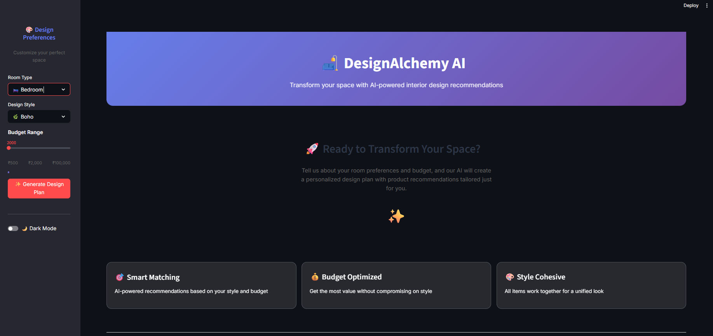

# 🛋️ DesignAlchemy AI

**Transform your space with AI-powered interior design recommendations.**

DesignAlchemy is an intelligent interior design assistant that helps you visualize and plan your perfect living space. By simply providing your room type, desired style, and budget, you get a complete design plan with layout tips, color palettes, and curated product recommendations.



---

## 🤔 Why It's Useful

Redecorating a room can be overwhelming. DesignAlchemy simplifies the process by acting as your personal design consultant.

*   **Instant Inspiration**: Overcome creative blocks with unique, AI-generated design concepts.
*   **Personalized Plans**: Get recommendations tailored to your unique taste and constraints.
*   **Budget-Aware**: All suggestions are filtered to respect your budget, making beautiful design accessible to everyone.
*   **Cohesive Vision**: The AI ensures all recommended items work together for a harmonious, professionally curated look.

## 👥 Who It's For

This tool is perfect for:

*   **Homeowners & Renters**: Looking to refresh their space without the high cost of a professional designer.
*   **Interior Design Students**: A great tool for learning about style composition and product sourcing.
*   **DIY Enthusiasts**: Who want a solid, actionable plan before starting a redecoration project.
*   **Anyone Curious about AI**: A fun, practical demonstration of collaborative AI agents solving a real-world problem.

## ✨ Key Features

*   **Interactive UI**: A clean and user-friendly interface built with Streamlit.
*   **Dynamic Generation**: AI agents create a new plan for every request.
*   **Multi-Agent System**: A team of specialized AI agents collaborates on your design.
*   **Style & Room Variety**: Supports multiple rooms (Living Room, Bedroom, etc.) and styles (Modern, Boho, Minimalist, etc.).
*   **Budget Optimization**: The AI crew works together to meet your budget.

---

## 💡 Example Output

Here's an example of what DesignAlchemy can create for you.

**1. The AI-Generated Design Plan**
This is the main output, providing a design concept and layout advice.


**2. Curated Product Recommendations**
The application also suggests products that fit the style and budget if you plan to expand your budget.


## 🛠️ Tech Stack & Architecture

This project leverages a modern stack to deliver a seamless user experience and powerful AI capabilities.

*   **Frontend**: **Streamlit** — For creating the interactive web application.
*   **AI Framework**: **CrewAI** — To orchestrate the collaboration between multiple AI agents.
*   **Language Model (LLM)**: **OpenAI (GPT-4/GPT-3.5)** — The "brain" that powers the AI agents.
*   **Language**: **Python**

### The AI Agent Pipeline

The core of this project is a "crew" of AI agents, each with a specific role. They work together in a pipeline to build your design plan:

1.  **🎨 Design Agent**: Receives the user's request (`room`, `style`) and generates initial ideas for layout, color palettes, and overall mood.
2.  **🔍 Product Agent**: Takes the design concept and searches for specific furniture and decor items that match the style.
3.  **💰 Budget Agent**: Reviews the product list, calculates the total cost, and removes items if the selection exceeds the user's budget.
4.  **✍️ Summary Agent**: Compiles the final design ideas and the budget-approved product list into a clean, easy-to-read report for the user.

This collaborative approach ensures the final output is creative, relevant, and practical.

---

## 🚀 Getting Started

Follow these steps to run the project locally.

### Prerequisites

*   Python 3.9+
*   An OpenAI API Key

### 1. Clone the Repository

```bash
git clone https://github.com/your-username/DesignAlchemy.git
cd DesignAlchemy
```

### 2. Set Up a Virtual Environment

It's recommended to use a virtual environment to manage dependencies.

```bash
# For Windows
python -m venv venv
.\venv\Scripts\activate

# For macOS/Linux
python3 -m venv venv
source venv/bin/activate
```

### 3. Install Dependencies

Install all the required packages from `requirements.txt`.

```bash
pip install -r requirements.txt
```

### 4. Configure Your API Key

Create a file named `.env` in the root of the project directory and add your OpenAI API key:

```
OPENAI_API_KEY="your_api_key_here"
```

### 5. Run the Application

Launch the Streamlit app with the following command:

```bash
streamlit run app.py
```

Your browser should open a new tab with the DesignAlchemy application running!
